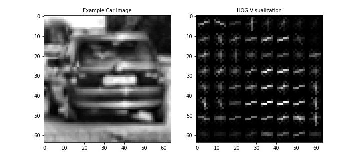
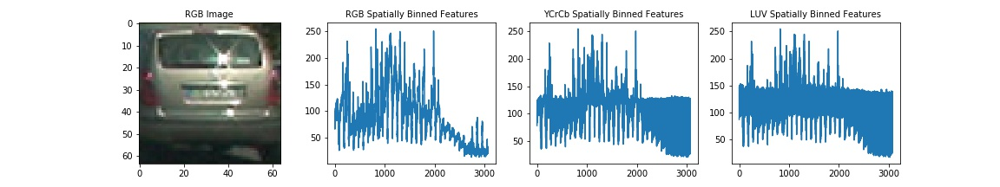
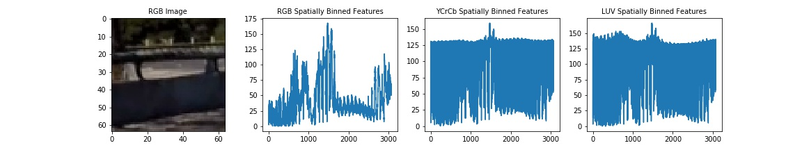
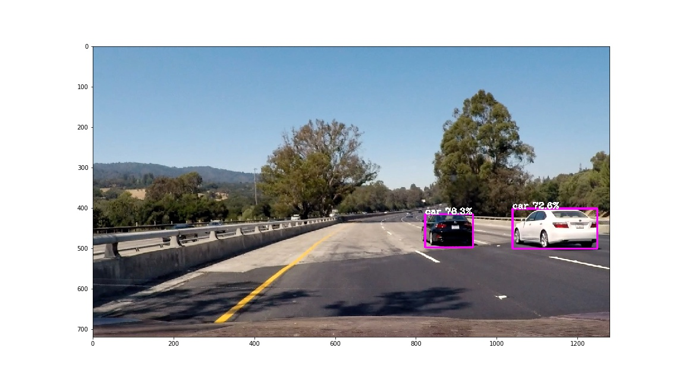

# **Vehicle Detection Project** 
---

Pongrut Palarpong  
May 11, 2018

---


The goals / steps of this project are the following:

* The goal is to write a software pipeline to identify vehicles in a video from a front-facing camera on a car. 


## [Rubric](https://review.udacity.com/#!/rubrics/513/view) Points
### Here I will consider the rubric points individually and describe how I addressed each point in my implementation.  

---
### Writeup / README

#### 1. Provide a Writeup / README that includes all the rubric points and how you addressed each one.  You can submit your writeup as markdown or pdf.  [Here](https://github.com/udacity/CarND-Vehicle-Detection/blob/master/writeup_template.md) is a template writeup for this project you can use as a guide and a starting point.  

You're reading it!

The above pipeline using HOG features and a linear SVM is well-known since 2005. Very recently extremely fast neural network based object detectors have emerged which allow object detection faster than realtime. I merely cloned the original darknet repository and applied YOLO to the project video. I only needed to do a minor code modification to allow saving videos directly. The result is quite amazing. As no sliding windows are used the detection is extremely fast. A frame is passed to the network and processed precisely once, hence the name YOLO — “you only look once”.

### Histogram of Oriented Gradients (HOG) vs. Convolutional Neural Network (CNN)

The histogram of gradients (HOG) is a descriptor feature. The HOG algorithm will check every pixel about how much darker the surrounding pixels are and then specify the direction that pixel is getting darker, then counts the occurrences of gradient orientation in localized portions of an image. The HOG result is features that use in support vector machine for the classification task.


<br/>
<p align="center">HOG Features Visualization</p>
<br/>



<p align="center">Color Histogram Features Visualization</p>

YOLO Real-Time Object Detection apply convolutional neural network architecture to classify an object. CNN architecture suitable for image classification because the image is indeed 2D width and height. CNN can do convolution operation by sweeping the relationship between each part of the image and creating essential filters. This convolution operation makes it easy for CNN to detect objects in multiple locations, difference lightings, or even just some part of objects in an image.


Example: A network with many convolutional layers

### My Vehicle Detection Model.
Model Cfg : yolo.cfg<br/>
Model weights: olo.weights<br/>
Model has a coco model name, loading coco labels.

|Source| Train? | Layer description                | Output size     |
|:----:|:------:|:--------------------------------:|:---------------:|
|      |        | input                            | (?, 608, 608, 3)|
| Load |  Yep!  | conv 3x3p1_1  +bnorm  leaky      | (?, 608, 608, 32)|
| Load  |  Yep!  | maxp 2x2p0_2                     | (?, 304, 304, 32)|
| Load  |  Yep!  | conv 3x3p1_1  +bnorm  leaky      | (?, 304, 304, 64)|
| Load  |  Yep!  | maxp 2x2p0_2                     | (?, 152, 152, 64)|
| Load  |  Yep!  | conv 3x3p1_1  +bnorm  leaky      | (?, 152, 152, 128)|
| Load  |  Yep!  | conv 1x1p0_1  +bnorm  leaky      | (?, 152, 152, 64)|
| Load  |  Yep!  | conv 3x3p1_1  +bnorm  leaky      | (?, 152, 152, 128)|
| Load  |  Yep!  | maxp 2x2p0_2                     | (?, 76, 76, 128)|
| Load  |  Yep!  | conv 3x3p1_1  +bnorm  leaky      | (?, 76, 76, 256)|
| Load  |  Yep!  | conv 1x1p0_1  +bnorm  leaky      | (?, 76, 76, 128)|
| Load  |  Yep!  | conv 3x3p1_1  +bnorm  leaky      | (?, 76, 76, 256)|
| Load  |  Yep!  | maxp 2x2p0_2                     | (?, 38, 38, 256)|
| Load  |  Yep!  | conv 3x3p1_1  +bnorm  leaky      | (?, 38, 38, 512)|
| Load  |  Yep!  | conv 1x1p0_1  +bnorm  leaky      | (?, 38, 38, 256)|
| Load  |  Yep!  | conv 3x3p1_1  +bnorm  leaky      | (?, 38, 38, 512)|
| Load  |  Yep!  | conv 1x1p0_1  +bnorm  leaky      | (?, 38, 38, 256)|
| Load  |  Yep!  | conv 3x3p1_1  +bnorm  leaky      | (?, 38, 38, 512)|
| Load  |  Yep!  | maxp 2x2p0_2                     | (?, 19, 19, 512)|
| Load  |  Yep!  | conv 3x3p1_1  +bnorm  leaky      | (?, 19, 19, 1024)|
| Load  |  Yep!  | conv 1x1p0_1  +bnorm  leaky      | (?, 19, 19, 512)|
| Load  |  Yep!  | conv 3x3p1_1  +bnorm  leaky      | (?, 19, 19, 1024)|
| Load  |  Yep!  | conv 1x1p0_1  +bnorm  leaky      | (?, 19, 19, 512)|
| Load  |  Yep!  | conv 3x3p1_1  +bnorm  leaky      | (?, 19, 19, 1024)|
| Load  |  Yep!  | conv 3x3p1_1  +bnorm  leaky      | (?, 19, 19, 1024)|
| Load  |  Yep!  | conv 3x3p1_1  +bnorm  leaky      | (?, 19, 19, 1024)|
| Load  |  Yep!  | concat [16]                      | (?, 38, 38, 512)|
| Load  |  Yep!  | conv 1x1p0_1  +bnorm  leaky      | (?, 38, 38, 64)|
| Load  |  Yep!  | local flatten 2x2                | (?, 19, 19, 256)|
| Load  |  Yep!  | concat [27, 24]                  | (?, 19, 19, 1280)|
| Load  |  Yep!  | conv 3x3p1_1  +bnorm  leaky      | (?, 19, 19, 1024)|
| Load  |  Yep!  | conv 1x1p0_1    linear           | (?, 19, 19, 425)|

Running entirely on CPU
Finished in 37.28185439109802s


### Sliding Window Search vs. You only look once 


The code for YOLO object detection is contained in the Step 6: of the IPython notebook.
Here is an example of vehicle detection code.
 
```
image = mpimg.imread('./test_image.jpg')
results = vehicle_detector.detect_vehicle(image)
plt.figure(figsize=(16, 9))
plt.imshow(image)
plt.show() 
```
Here is an example result image:



Ref:<br/>
[You Only Look Once: Unified, Real-Time Object Detection](https://arxiv.org/abs/1506.02640)
[YOLO — You only look once, real time object detection explained](https://towardsdatascience.com/yolo-you-only-look-once-real-time-object-detection-explained-492dc9230006)
[Real-time object detection with YOLO](http://machinethink.net/blog/object-detection-with-yolo/)

### Video Implementation

#### 1. Provide a link to your final video output.  Your pipeline should perform reasonably well on the entire project video (somewhat wobbly or unstable bounding boxes are ok as long as you are identifying the vehicles most of the time with minimal false positives.)
Here's a [link to my video result](./project_video_detect_out.mp4)<br/>
[](http://www.youtube.com/watch?v=CFzyrBdf2qQ "Advanced Lane Finding & Vehicle Detection with YOLO")


#### 2. Describe how (and identify where in your code) you implemented some kind of filter for false positives and some method for combining overlapping bounding boxes.

I recorded the positions of positive detections in each frame of the video.  From the positive detections I created a heatmap and then thresholded that map to identify vehicle positions.  I then used `scipy.ndimage.measurements.label()` to identify individual blobs in the heatmap.  I then assumed each blob corresponded to a vehicle.  I constructed bounding boxes to cover the area of each blob detected.  

Here's an example result showing the heatmap from a series of frames of video, the result of `scipy.ndimage.measurements.label()` and the bounding boxes then overlaid on the last frame of video:

### Here are six frames and their corresponding heatmaps:

![alt text][image5]

### Here is the output of `scipy.ndimage.measurements.label()` on the integrated heatmap from all six frames:
![alt text][image6]

### Here the resulting bounding boxes are drawn onto the last frame in the series:
![alt text][image7]


---

### Discussion

#### 1. Briefly discuss any problems / issues you faced in your implementation of this project.  Where will your pipeline likely fail?  What could you do to make it more robust?

Here I'll talk about the approach I took, what techniques I used, what worked and why, where the pipeline might fail and how I might improve it if I were going to pursue this project further.  

